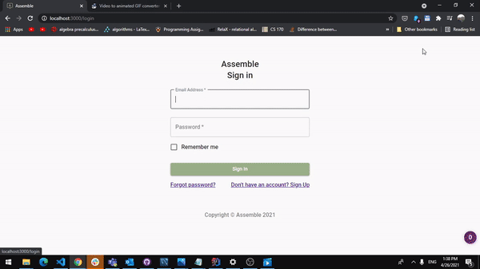
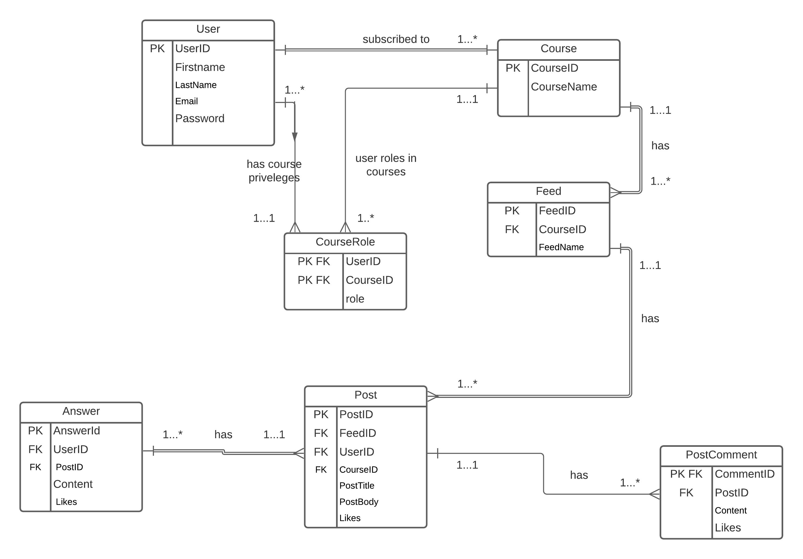
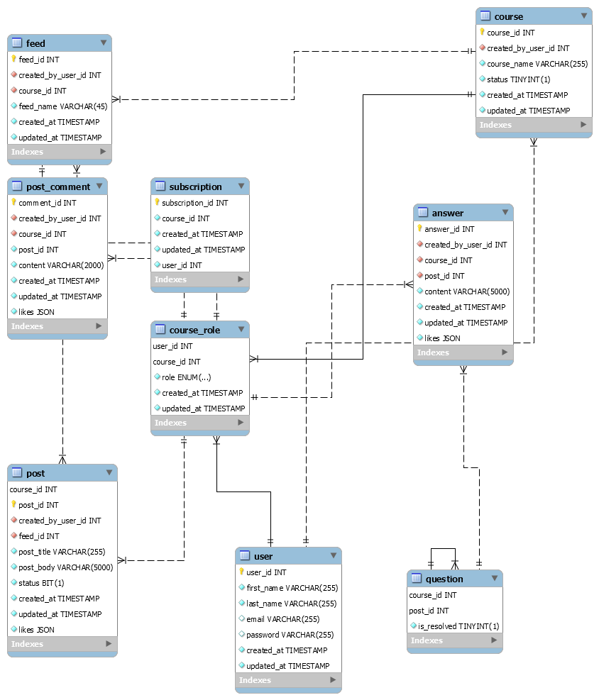

# Assemble

Assemble is a platform that allows for students and instructors to engage beyond classrooms. We
employ [TinyMCE Editor](https://www.tiny.cloud/) API for users to generate HTML content.

Many a times, questions might already have been provided with great answers at StackExchangeAPI
While creating a new post, while typing in on post title field and pressing “right” arrow button,
triggers a call to API which fetches the most relevant queries back to the page available to the
student as clickable links to navigate to.

Following are the services/frameworks that have used to develop Assemble :

1) Assemble's User Interface has been developed using React component.
2) [Material UI ](https://material-ui.com/) - User Interface Design & Styling
3) React-Redux for front end state management
4) [React-Redux User Session ](https://www.npmjs.com/package/redux-react-session) - To maintain user
   sessions
5) Backend server using SpringBoot
6) JWT and JBCrypt REST filtering with authentication and authorization handling
7) JPA (Java Persistence API) ORM to interact with MySQL database
8) For data persistence, we have employed MySQL relational database which is hosted on AWS.
9) Java spring application-wide exception handling with ControllerAdvice

Above figures is UML diagram for Assemble

Above figure is EER diagram for Assemble (Database Entity Mapping)

## Running this app locally

Running the application locally entails running both the backend and frontend

### Setting up the backend

1. To run the backend, open backend folder in IntelliJ, and type in `mvn clean install` which would
   install all dependencies.
2. Pl note that Java Version used is 11
3. Start SpringBoot Server with preferred IDE configuration or from command line with java jar
   command

### Configuring the frontend

Create a `.env` file in the `frontend` directory, with the
line: `REACT_APP_SERVER_URL=http://localhost:8080/api` (if you deploy the backend to another
location, put that location here instead)

### Running the frontend

In the `frontend` directory, run `npm start` (again, you'll need to run `npm install` the very first
time). After several moments (or minutes, depending on the speed of your machine), a browser will
open with the frontend running locally. The frontend will automatically re-compile and reload in
your browser if you change any files in the `frontend/src` directory.

### Login Credentials

Use (Email : 1@1, Password: 1) which are user credentials of Professor Dumbledore to explore
Assemble application as an instructor

